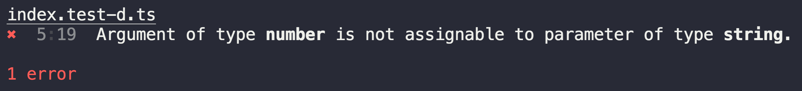

# tsd-check [](https://travis-ci.org/SamVerschueren/tsd-check)

> Check TypeScript type definitions


## Install

```
$ npm install tsd-check
```


## Usage

Let's assume we wrote a `index.d.ts` type definition for our concat module.

```ts
declare const concat: {
	(value1: string, value2: string): string;
	(value1: number, value2: number): string;
};

export default concat;
```

In order to test this definition, add a `index.test-d.ts` file.

```ts
import concat from '.';

concat('foo', 'bar');
concat(1, 2);
```

Running `npx tsd-check` as a command will verify that the type definition works correctly.

Let's add some extra [assertions](#assertions). We can assert the return type of our function call to match a certain type.

```ts
import {expectType} from 'tsd-check';
import concat from '.';

expectType<string>(concat('foo', 'bar'));
expectType<string>(concat(1, 2));
```

The `tsd-check` command will succeed again.

We change our implementation and type definition to return a `number` when both inputs are of type `number`.

```ts
declare const concat: {
	(value1: string, value2: string): string;
	(value1: number, value2: number): number;
};

export default concat;
```

If we don't change the test file and we run the `tsd-check` command again, the test will fail.




## Assertions

### expectType<T>(value)

Check if a value is of a specific type.


## License

MIT © [Sam Verschueren](https://github.com/SamVerschueren)
